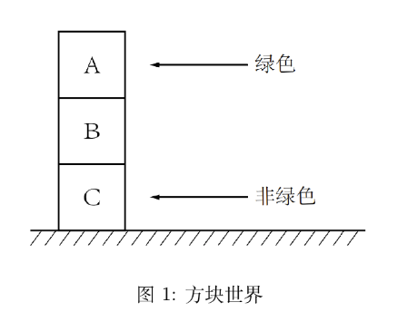

专业：人工智能
姓名：黄振华
学号：3240105155

##### 1. 单选题：在非单调推理中，可废止规则的主要特点是
A. 结论必然为真 B. 结论可能被新信息推翻
C. 适用于确定的知识 D. 不涉及假设

答案：B

##### 2. 请分别举出一个演绎推理和归纳推理的例子。

**演绎推理：**
大前提：浙江大学的学生都要体测
小前提：我是浙江大学的学生
结论：我要体测

**归纳推理：**
《人工智能逻辑》课堂的学生中男生占比极高，可以推断出学习人工智能相关知识的人中男生的占比高。


##### 3. 当一个论证的结论与另一个论证的结论发生矛盾时，我们说这两个论证相互反驳。请举例说明“反驳”这一概念，并思考在什么情况下论证之间可以存在反驳。

**举例说明：**
论证A：小明每个月生活费2000元，他每个月的开销刚好是2000元，所以小明月光。
论证B：小明虽然会把生活费花光，但是他家教每个月能挣1000元，所以小明每月能攒下1000元。

**存在反驳的情况：**
1. 知识不完备：新的信息可能会推翻之前的结论。
2. 前提不一致：不同的论证可能基于不同的前提，这些前提之间可能存在矛盾。
3. 信息源不一致：信息源的可靠性不同，可能导致不同的结论。


##### 4. 说明为什么经典一阶逻辑在处理不完备或不一致的知识时存在局限性。
经典一阶逻辑在知识不完备时无法得出结论，因为它要求所有的知识都是确定和完整的。
当知识不一致时，经典一阶逻辑会得出矛盾或者荒谬的结论。

##### 5. 考虑一个“方块世界”的例子（图 1）：桌子上有三个有颜色的方块叠在一起，顶部那块是绿色的，底部那块不是绿色的，中间方块的颜色未知。为了判断是否有一个绿色方块在一个非绿色方块之上，需要用到哪些知识？如何表示这些知识并运用这些知识进行推理？

**需要的知识：**方块A是绿色的，方块C不是绿色的；方块A在方块B上，方块B在方块C上。
可以用谓词逻辑表示这些知识：
```
Green(x)：x是绿色的
On(x, y)：x在y上
```

所以已知信息可以表示为：
```
Green(A)
¬Green(C)
On(A, B)
On(B, C)
```

根据这些知识，再对方块B的颜色进行假设：
```
假设Green(B):
则有Green(B) ∧ ¬Green(C) ∧ On(B, C)
即存在绿色方块B在非绿色方块C上。

假设¬Green(B):
则有¬Green(B) ∧ Green(A) ∧ On(A, B)
即存在绿色方块A在非绿色方块B上。
```
因此，无论方块B的颜色如何，都存在一个绿色方块在一个非绿色方块之上。
