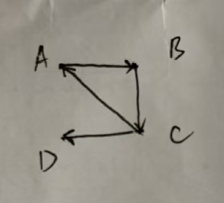

专业：人工智能
姓名：黄振华
学号：3240105155

#### 1. 设集合 A = {1, 2, 3}。请写出 A 的幂集 P(A)，并计算 P(A) 中元素的个数。说明为什么选项 {{1}, {2}, {3}} 不是 A 的幂集。
P(A) = {∅, {1}, {2}, {3}, {1, 2}, {1, 3}, {2, 3}, {1, 2, 3}}
P(A) 中元素的个数为 2^3 = 8
{{1}, {2}, {3}} 缺少A的其他子集比如∅, {1, 2}，因此它不是 A 的幂集。

#### 2. 设 A = {1, 2}，B = {x, y}。
**(a) 写出 A × B 的所有元素。**
A × B = {(1, x), (1, y), (2, x), (2, y)}
**(b) 定义关系 R ⊆ A × B，其中 (a, b) ∈ R 当且仅当 a 是奇数。请列出 R 中的所有有序对。**
R = {(1, x), (1, y)}

#### 3. 设集合 S = {1, 2, 3}，定义 S 上的二元关系 R = {(1, 1),(2, 2),(3, 3),(1, 2),(2, 1)}。
**(a) 判断 R 是否具有自反性、对称性和传递性，并简要说明理由。**
有自反性：对于集合 S 中的每个元素 x，关系 R 满足 (x, x) ∈ R，因此 R 具有自反性。
有对称性：对于集合 S 中的每个元素 x 和 y，如果(x, y) ∈ R，则(y, x) ∈ R，因此 R 具有对称性。
有传递性：对于集合 S 中的每个元素 x、y 和 z，如果(x, y) ∈ R 且 (y, z) ∈ R，则 (x, z) ∈ R，因此 R 具有传递性。

**(b) R 是否是 S 上的等价关系？为什么？**
R 是 S 上的等价关系，因为它具有自反性、对称性和传递性。

#### 4. 一个有向图 G = (V, E)，其中顶点集 V = {A, B, C, D}，边集 E = {(A, B),(B, C),(C, A),(C, D)}。
**(a) 画出该有向图的示意图。**

**(b) 找出图 G 的所有强连通分量（Strongly Connected Components）。**
图 G 的强连通分量为 {A, B, C} 和 {D}.
**(c) 该图是否为强连通图？请说明理由。**
该图不是强连通图，因为顶点 D 无法通过有向路径到达其他顶点。

#### 5.
**(a) 若一个无向图 G 是一棵树，且拥有 n 个顶点，请问它有多少条边？**
n-1 条边。
**(b) 在一个聚会上，如果有 10 个人，每个人都与其他所有人恰好握手一次，请问总共发生了多少次握手？请将此问题建模为图论问题（指出顶点数和边数），并利用完全图的性质进行验证。**
将每个人视为一个顶点，每次握手视为一条边。对于 10 个人的聚会，顶点数为 10。每个人与其他 9 个人握手一次，因此边数为 C(10, 2) = 45，所以总共发生了 45 次握手。