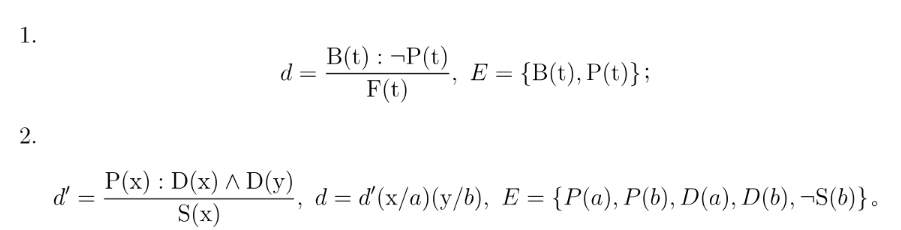
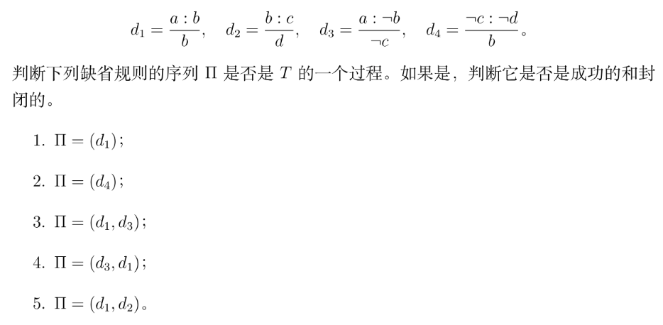
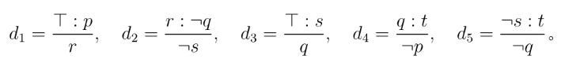
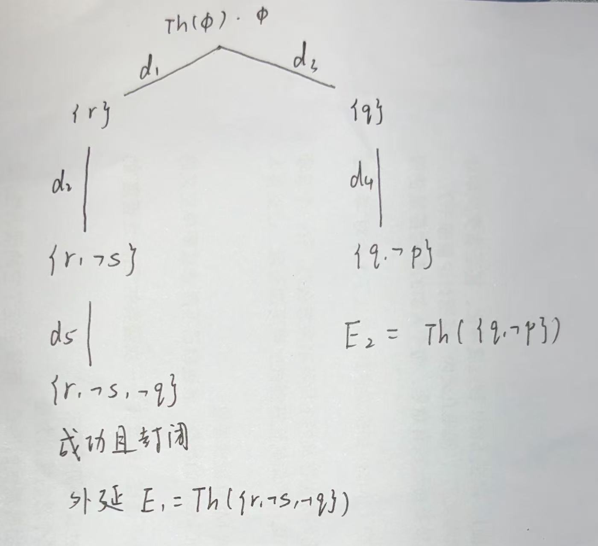

专业：人工智能
姓名：黄振华
学号：3240105155

### 1. 判断下列缺省规则 d 能否被应用于集合 E：

1. 不能，因为 E 可以推导出 ¬(¬P(t))，这是 d 的缺省条件的否定。
2. 可以，$d=\frac{P(a):D(a) \wedge D(b)}{S(a)}$，E 可以推导出 P(a)，并且 E 不能推导出 ¬(D(a) ∧ D(b))。

### 2. 给定缺省理论 T = ⟨W, D⟩, 其中 W = {a, d}, D = {d1, d2, d3}

1. 是一个过程因为 d1 的前提可以由 W 推导出，d1 的缺省条件的否定无法由 W 推导出。
    是成功的，结论集为 {a, d, b}，与一致性条件 b 一致。
    不是封闭的，因为 d2 可以扩充结论集。

2. 不是一个过程，因为 d4 的前提 ¬c 不在 W 中。

3. 是一个过程，因为 他们两个的前提 a 在 W 中，一致性条件{b}、{¬b} 与 W 不矛盾。
    不是成功的，因为 d1 的结论 b 与 d2 的一致性条件 ¬b 矛盾。
    不是封闭的，因为不成功。

4. 是过程。
    不成功，因为最终集包含 b，与 d3 的一致性条件 ¬b 矛盾。
    不是封闭的，因为不成功。

5. 是过程。
    成功。
    封闭，因为剩余规则的一致性条件与结论集矛盾，无法被应用，无法退出新结论。

### 3. 给定缺省理论 T = ⟨W, D⟩, 其中 W = ∅, D = {d1, d2, d3, d4, d5}

用外延的不动点定义求出的所有外延，并用过程树对求解过程加以说明。

1. 假设 E = Th({r, ¬s, ¬q})
    规则 d1 的前提 $\top$ 满足，一致性条件 p 满足，结论 r 加入 E。
    规则 d2 的前提 r 满足，一致性条件 ¬q 满足，结论 ¬s 加入 E。
    同理，从 E 推导出的所有结论恰好等于 {r, ¬s, ¬q}，因此 E 是一个外延。

2. 假设 E = Th({q, ¬p})
    方法同上，应用规则 d3 和 d4，得到 结论集 {q, ¬p}，因此 E 是一个外延。

### 4. 把如下自然语言语句翻译为一阶缺省理论，并检查结论是否可以被轻信地或怀疑地得出：
(a) 通常，浙江丽水的农户使用电商销售农产品。使用电商销售农产品的“丽水山耕”核心农户通常不是贫困户。浙江丽水的农户通常是“丽水山耕”的核心农户，比如小明，但是小刚是这条规则的例外。结论：小明不是贫困户；小刚是贫困户。

**答**：
定义谓词：
- $F(x)$：$x$ 是浙江丽水的农户
- $E(x)$：$x$ 使用电商销售农产品
- $C(x)$：$x$ 是“丽水山耕”核心农户
- $P(x)$：$x$ 是贫困户

常量：$m$（小明），$g$（小刚）

缺省规则集 $D$：
1. $d_1 = \frac{F(x) : E(x)}{E(x)}$
2. $d_2 = \frac{E(x) \wedge C(x) : \neg P(x)}{\neg P(x)}$
3. $d_3 = \frac{F(x) : C(x)}{C(x)}$

背景知识 $W$：
$W = \{ F(m), F(g), \neg C(g) \}$

**结论分析**：
对于小明 $m$：
从 $F(m)$ 出发，应用 $d_1$ 得到 $E(m)$，应用 $d_3$ 得到 $C(m)$。接着满足 $d_2$ 的前提，应用 $d_2$ 可以得出 $\neg P(m)$。由于没有其他冲突的规则，在这个唯一的推理分支中能够得到 $\neg P(m)$，因此**“小明不是贫困户”既可以被轻信地得出，也可以被怀疑地得出**。

对于小刚 $g$：
由于 $W$ 中已知 $\neg C(g)$，规则 $d_3$ 的一致性条件不被满足，无法得出 $C(g)$。因为缺少 $C(g)$，规则 $d_2$ 的前提不满足，无法应用，故无法推导出 $P(g)$ 或是 $\neg P(g)$。因此 **“小刚是贫困户”既不能被轻信地得出，也不能被怀疑地得出**。

(b) 缺省地，农户就地销售农产品。但是，浙江丽水的农户通常是“丽水山耕”的平台农户，而“丽水山耕”的平台农户通常不就地销售农产品。张三和李四是浙江台州的农户，小明和小刚是浙江丽水的农户。结论：张三和李四就地销售农产品；小明和小刚不就地销售农产品。

**答**：
定义谓词：
- $F(x)$：$x$ 是农户
- $S(x)$：$x$ 就地销售农产品
- $L(x)$：$x$ 是浙江丽水的农户
- $T(x)$：$x$ 是浙江台州的农户
- $P(x)$：$x$ 是“丽水山耕”的平台农户

常量：$z$（张三），$l$（李四），$m$（小明），$g$（小刚）

缺省规则集 $D$：
1. $d_1 = \frac{F(x) : S(x)}{S(x)}$
2. $d_2 = \frac{L(x) : P(x)}{P(x)}$
3. $d_3 = \frac{P(x) : \neg S(x)}{\neg S(x)}$

背景知识 $W$：
$W = \{ \forall x(L(x) \rightarrow F(x)), \forall x(T(x) \rightarrow F(x)), T(z), T(l), L(m), L(g) \}$

**结论分析**：
对于张三 $z$ 和李四 $l$：
由 $T(z), T(l)$ 和 $W$ 可推出 $F(z), F(l)$。只能应用规则 $d_1$，分别得出 $S(z)$ 和 $S(l)$，且不存在冲突，因此 **“张三和李四就地销售农产品”既可以被轻信地得出，也可以被怀疑地得出**。

对于小明 $m$ 和小刚 $g$：
由 $L(m)$ 可推出 $F(m)$。此时存在两个互不相容的扩展过程：
1. 先应用 $d_1$ 得到 $S(m)$，再应用 $d_2$ 得到 $P(m)$。此时由于 $S(m)$ 已知，无法通过 $d_3$ 的一致性条件，过程结束，结论包含 $S(m)$。
2. 先应用 $d_2$ 得到 $P(m)$，接着应用 $d_3$ 得到 $\neg S(m)$。此时由于 $\neg S(m)$，无法通过 $d_1$ 的一致性条件，过程结束，结论包含 $\neg S(m)$。

小刚 $g$ 的推理同理。由于 $\neg S(m)$ 和 $\neg S(g)$ 只存在于其中一个外延中，而另一个外延中推导出了 $S(m)$ 和 $S(g)$，因此 **“小明和小刚不就地销售农产品”可以被轻信地得出，但不能被怀疑地得出**。