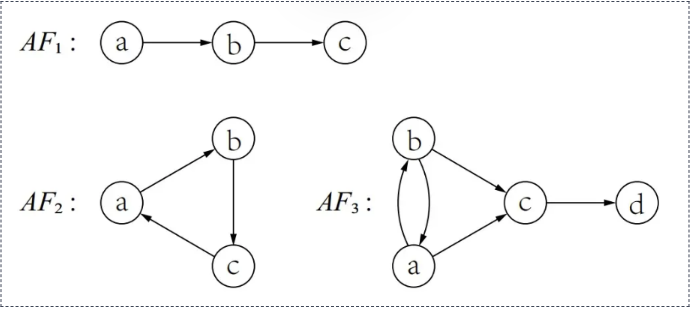
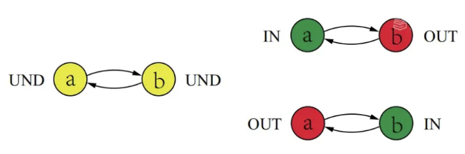

专业：人工智能
姓名：黄振华
学号：3240105155

### 1. 给定一个论辩框架 AF = ⟨AR, attacks⟩，设 L1 = {in(L1), out(L1), undec(L1)} 和L2 = {in(L2), out(L2), undec(L2)} 是 AF 在某语义下的两个标记。如果 in(L1) ⊂ in(L2)，请问：
- out(L1) ⊆ out(L2) 是否成立？如果成立，请证明。如果不成立，请给出一个反例。
- out(L1) ⊂ out(L2) 是否成立？如果成立，请证明。如果不成立，请给出一个反例。

**解答：**

在论辩理论中，常见的论辩语义（如完全语义、偏好语义、基语义、稳定语义等）所对应的标记都满足**完全标记（Complete Labeling）**的性质。以下的解答与证明基于 $L_1$ 和 $L_2$ 是完全标记的情况。

- **第一小问：`out(L1) ⊆ out(L2)` 是否成立？**

  **结论：** 成立。
  
  **证明：**
  对于任一完全标记 $L$ ，根据定义，一个论证 $A \in out(L)$ 当且仅当存在一个论证 $B \in in(L)$ 使得 $(B, A) \in attacks$ （即 $B$ 攻击 $A$ ）。
  已知 $in(L_1) \subset in(L_2)$ ，这意味着任取 $B \in in(L_1)$ ，必然有 $B \in in(L_2)$ 。
  假设 $A \in out(L_1)$ ，则存在 $B \in in(L_1)$ 使得 $B$ 攻击 $A$ 。
  由于 $in(L_1) \subset in(L_2)$ ，该论证 $B$ 也肯定属于 $in(L_2)$ 。
  因此，在 $L_2$ 中，由于存在 $B \in in(L_2)$ 且 $B$ 攻击 $A$ ，根据完全标记的定义，必然有 $A \in out(L_2)$ 。
  由此可知，对于任意的 $A \in out(L_1)$ ，都有 $A \in out(L_2)$ ，即 $out(L_1) \subseteq out(L_2)$ 成立。

- **第二小问：`out(L1) ⊂ out(L2)` 是否成立？**

  **结论：** 成立。
  
  **证明：**
  我们采用反证法。假设 $out(L_1) \subset out(L_2)$ 不成立；由于第一问已经证明了 $out(L_1) \subseteq out(L_2)$ ，所以此时只能是 $out(L_1) = out(L_2)$ 。
  由于已知 $in(L_1) \subset in(L_2)$ 是严格子集，这意味着存在至少一个论证 $X \in in(L_2)$ 且 $X \notin in(L_1)$ 。
  在标记 $L_2$ 中，由于 $X \in in(L_2)$ ，根据完全标记的定义，所有攻击 $X$ 的论证都必定属于 $out(L_2)$。
  因为我们假设了 $out(L_1) = out(L_2)$ ，所以所有攻击 $X$ 的论证也都必定属于 $out(L_1)$ 。
  回到标记 $L_1$ ，如果所有攻击 $X$ 的论证都已经属于 $out(L_1)$ ，那么根据完全标记的结构特性（一个论证如果其所有攻击者都在 `out` 中，则该论证必须被标为 `in` ），论证 $X$ 必须有 $X \in in(L_1)$ 。
  但这与之前得出的 $X \notin in(L_1)$ 产生了矛盾。
  因此，假设不成立。从而必然有 $out(L_1) \neq out(L_2)$ 。结合 $out(L_1) \subseteq out(L_2)$ ，结论 $out(L_1) \subset out(L_2)$ 严格成立。

### 2. 分别求出下图中论辩框架的不动点。

**解答：**

1. **对于 $AF_1$**：
   - 唯一的不动点为：**$\{a, c\}$**。
   - **原因**：$a$ 不受任何攻击，因此包含 $a$；$a$ 攻击了 $b$，解除了 $b$ 对 $c$ 的攻击，$c$ 因此得到该集合的防卫，故 $c$ 必须在该集合中。该不动点也是唯一的完全扩张。

2. **对于 $AF_2$**：
   - 无冲突的不动点（完全扩张）只有：**$\emptyset$** （空集）。
   - **原因**：$a, b, c$ 构成长度为3的相互攻击环，不存在任何不受攻击的源头，没有论证能被单独防卫。

3. **对于 $AF_3$**：
   - 无冲突的不动点（完全扩张）共有 3 个，分别为：**$\emptyset$**、**$\{a, d\}$**、**$\{b, d\}$**。
   - **原因**：
     - 若不假设任何论证成立，$a,b,c$ 相互牵制，无人被防卫，空集 $F_{AF}(\emptyset)=\emptyset$ 为不动点。
     - 假设 $a$ 成立，此时 $a$ 能够击败 $b$ 和 $c$；由于 $c$ 被击败，$d$ 免受攻击而得以防卫，产生不动点 $\{a, d\}$。
     - 由于 $a$ 和 $b$ 是完全对称的，同理可得 $b$ 成立时产生不动点 $\{b, d\}$。）

### 3. 请说明下图中论辩框架的标记可以是什么论辩语义下的标记。

**解答：**

图中给出了该框架下三种可能的标记（Labeling）：
1. **图左**：$a$ 和 $b$ 均为 `UND`（未决），即 $in=\emptyset, out=\emptyset, und=\{a,b\}$。
2. **图右上**：$a$ 为 `IN`（接受），$b$ 为 `OUT`（拒绝），即 $in=\{a\}, out=\{b\}, und=\emptyset$。
3. **图右下**：$a$ 为 `OUT`（拒绝），$b$ 为 `IN`（接受），即 $in=\{b\}, out=\{a\}, und=\emptyset$。

这些标记在不同的论辩语义下具有如下情况：

- **完全语义**：上述**三个标记全部都是**合法的完全标记。它们皆满足“被标为IN当且仅当其所有攻击者被标为OUT”等完全性约束，恰好穷举了该论辩框架的所有完全标记。
- **基语义**：**有且仅有图左**的标记。基语义即要求 `in` 集合最小的完全标记，包含最少论证（空集）的状态即为基语义的结果。
- **优先语义**：**对应图右上和图右下**的标记。偏好语义要求 `in`（及 `out`）的集合在集合包含关系下最大化。
- **稳定语义**：**对应图右上和图右下**的标记。稳定语义要求框架中不能有论证被标记为 `UND`（所有论证必须非 `IN` 即 `OUT`）。

