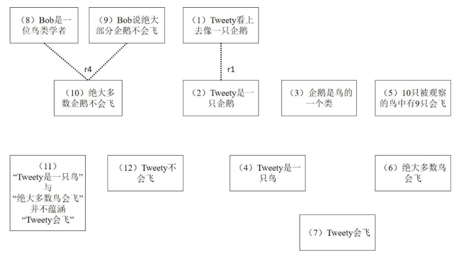
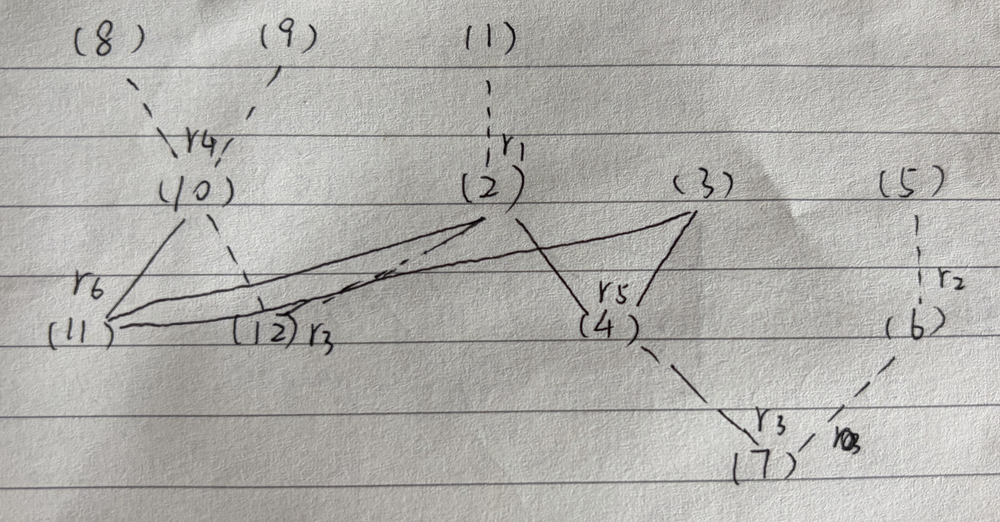
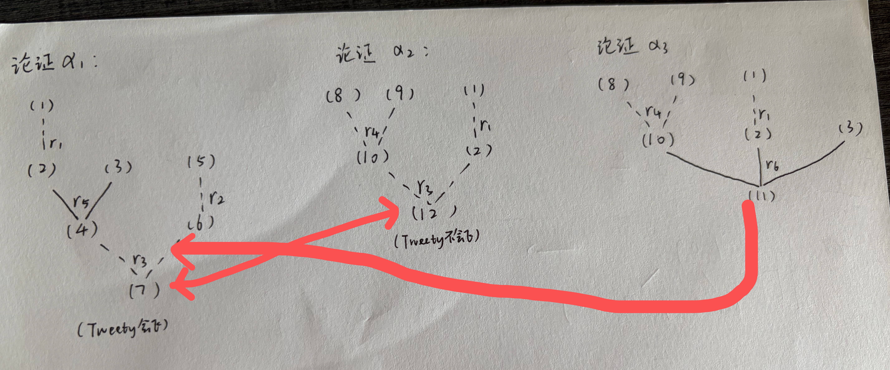

专业：人工智能
姓名：黄振华
学号：3240105155

（1）请根据给定的推理规则补齐下图中前提与结论之间的关系。
（2）请画出论证以及论证之间的攻击关系。
注：用虚线表示可废止的推理，用实线表示硬性的（演绎）推理。

$r1$： $x$ 看上去具有某种属性 $P$ 是相信 $x$ 是 $P$ 的一个可废止理由。
$r2$： 半数以上被观察的 $P$ 具有 $Q$ 属性是相信绝大多数 $P$ 具有 $Q$ 属性的一个可废止理由。
$r3$： 绝大多数 $P$ 具有 $Q$ 属性并且 $x$ 是 $P$ 是相信 $x$ 是 $Q$ 的一个可废止理由。
$r4$： 一个关于鸟类的命题 $\phi$ 被一位鸟类学者提出是相信命题 $\phi$ 的一个可废止理由。
$r5$： $P$ 是 $Q$ 的一个类并且 $x$ 是 $P$，则 $x$ 是 $Q$。
$r6$： $x$ 是 $R$，绝大多数 $R$ 不是 $Q$，并且 $R$ 是 $P$ 的一个类，则“$x$ 是 $P$"且“绝大多数 $P$ 是 $Q$"并不蕴涵“$x$ 是 $Q$"。

答：
（1）如图所示：

（2）如图所示：

其中 $\alpha_1$ 与 $\alpha_2$ 互相反驳 (Rebut)，$\alpha_3$ 削弱 (Undercut) $\alpha_1$.