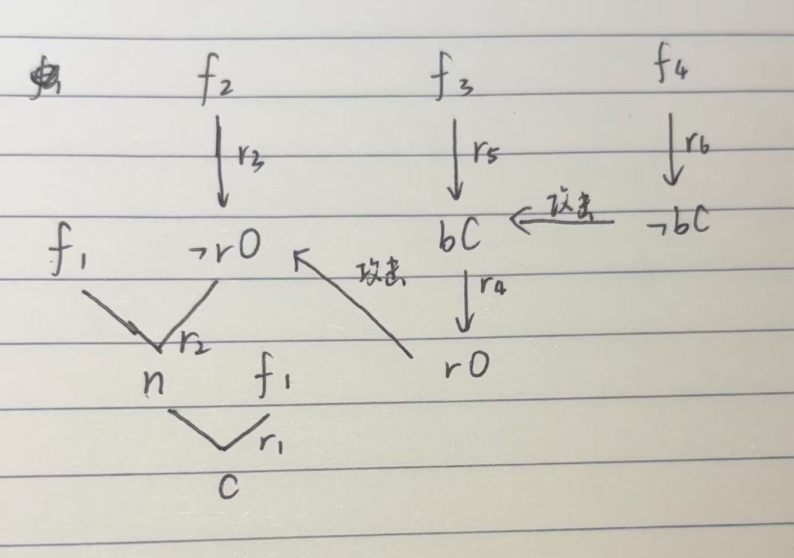
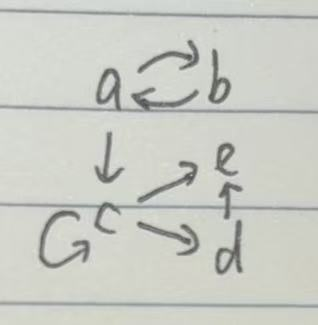

专业：人工智能
姓名：黄振华
学号：3240105155

### 1. 贝叶斯网络推理

考虑如下例子：脑转移瘤可能是脑瘤的一个可能原因，也是血清总钙升高的一个解释。反过来，这两者中的任何一种都可能导致患者偶尔陷入昏迷。严重的头痛也可以用脑瘤来解释。在贝叶斯网络中表示这些因果联系。设 a 代表“转移性癌症”，b 代表“血清总钙含量增加”，c 代表“脑瘤”，d 代表“偶尔昏迷”，e 代表“严重头痛”。

- 给出这个网络中隐含的一个独立性假设的例子。

- 假设给定以下概率:

    - $P(a)$ = 0.2
    - $P(b | a)$ = 0.8 , $P(b | \neg a)$ = 0.2
    - $P(c | a)$ = 0.2 , $P(c | \neg a)$ = 0.05
    - $P(e | c)$ = 0.8 , $P(e | \neg c)$ = 0.6
    - $P(d | b, c)$ = 0.8 , $P(d | \neg b, c)$ = 0.8
    - $P(d | b, \neg c)$ = 0.8 , $P(d | \neg b, \neg c)$ = 0.05

假设还给出了某个病人患有严重头痛但尚未陷入昏迷。计算剩下的八种可能性（即，根据 a、b 和 c 发生还是未发生）的联合概率。

- 根据给出的数字，病人患有转移性癌症的先验概率是 0.2。鉴于病人患有严重头痛但尚未陷入昏迷，我们现在是否更倾向于认为病人患有癌症？请解释。

答：
1. 给定 a，则 b 和 c 是条件独立的。

2. 
    根据贝叶斯网络的联合概率链式法则：
    $$
    P(a, b, c, e, \neg d) = P(a) P(b | a) P(c | a) P(e | c) P(\neg d | b, c)
    $$
    我们可以计算每种组合的概率：

    $$
    \begin{aligned}
    & P(a, b, c, e, \neg d) = 0.2 \times 0.8 \times 0.2 \times 0.8 \times (1 - 0.8) = 0.00512 \\
    & P(a, b, \neg c, e, \neg d) = 0.2 \times 0.8 \times 0.8 \times 0.6 \times (1 - 0.8) = 0.01536 \\
    & P(a, \neg b, c, e, \neg d) = 0.2 \times 0.2 \times 0.2 \times 0.8 \times (1 - 0.8) = 0.00128 \\
    & P(a, \neg b, \neg c, e, \neg d) = 0.2 \times 0.2 \times 0.8 \times 0.6 \times (1 - 0.05) = 0.01824 \\
    & P(\neg a, b, c, e, \neg d) = 0.8 \times 0.2 \times 0.05 \times 0.8 \times (1 - 0.8) = 0.00128 \\
    & P(\neg a, b, \neg c, e, \neg d) = 0.8 \times 0.2 \times 0.95 \times 0.6 \times (1 - 0.8) = 0.01824 \\
    & P(\neg a, \neg b, c, e, \neg d) = 0.8 \times 0.8 \times 0.05 \times 0.8 \times (1 - 0.8) = 0.00512 \\
    & P(\neg a, \neg b, \neg c, e, \neg d) = 0.8 \times 0.8 \times 0.95 \times 0.6 \times (1 - 0.05) = 0.034656 \\
    \end{aligned}
    $$

3. 
    在患者患有严重头痛但尚未陷入昏迷的情况下，我们可以使用贝叶斯定理来计算患者患有转移性癌症的后验概率。
    根据全概率公式：
    $$
    \begin{aligned}
    P(a | e, \neg d) & = \frac{P(a , e, \neg d)}{P(e, \neg d)} \\
    & = \frac{\sum_{b, c} P(a, b, c, e, \neg d)}{\sum_{a, b, c} P(a, b, c, e, \neg d)} \\
    & = \frac{0.00512 + 0.01536 + 0.00128 + 0.01824}{0.00512 + 0.01536 + 0.00128 + 0.01824 + 0.00128 + 0.01824 + 0.00512 + 0.034656} \\
    & = \frac{0.0400}{0.4112} \approx 0.0972
    \end{aligned}
    $$

    患者患有转移性脑癌的后验概率远低于先验概率，因此倾向于认为不患癌症。

### 2. 缺省逻辑外延

给定缺省理论 $T = \langle W, D \rangle$, 其中 $W = \emptyset$, $D = \{d_1, d_2, d_3, d_4, d_5\}$

$$
d_1 = \frac{\top : p}{r}, d_2 = \frac{r: \neg q}{\neg s}, d_3 = \frac{\top : s}{q}, d_4 = \frac{q : t}{\neg p}, d_5 = \frac{\neg s : t}{\neg q}.
$$

用外延的不动点定义求出的所有外延，并用过程树对求解过程加以说明。

答：
求外延:
1. 应用 $d_1$:
    1. 应用 $d_1$，得到 $W_1 = \{r\}$。
    2. 应用 $d_2$，得到 $W_2 = \{r, \neg s\}$。
    3. 应用 $d_5$, 得到 $W_3 = \{r, \neg s, \neg q\}$。
    此时，$d_3$ 和 $d_4$ 都不能应用，因为 $\neg s$ 与 $d_3$ 的缺省条件冲突，$\neg q$ 与 $d_4$ 的前提冲突。
    得到外延 $E_1 = Th(\{r, \neg s, \neg q\})$。

2. 应用 $d_3$:
    1. 应用 $d_3$，得到 $W_1 = \{q\}$。
    2. 应用 $d_4$，得到 $W_2 = \{q, \neg p\}$。
    此时，$d_1$ 、$d_2$ 和 $d_5$ 都不能应用，因为 $\neg p$ 与 $d_1$ 的缺省冲突，$q$ 与 $d_2$ 的缺省条件和 $d_5$ 的结论冲突。
    得到外延 $E_2 = Th(\{q, \neg p\})$。

过程树：

### 3. 子句化与消解

给定前提集合 $Γ$ 如下：$Γ=\{p→(q∨r),p∧¬q,¬r\}$

1. 将上述所有前提转化为子句公式（即合取范式对应的子句集合）。

2. 使用消解规则，构造一个形式推演序列，证明该前提集合是不可满足的（即推导出空子句 $\bot$ 或 $[]$）。

答：

1.
    $$
    \begin{aligned}
    p \rightarrow (q \vee r) &\equiv \neg p \vee q \vee r \\
    p \wedge \neg q &\equiv p, \neg q \\
    \neg r &\equiv \neg r
    \end{aligned}
    $$

    因此子句公式为：$(\{¬p, q, r\}, \{p\}, \{¬q\}, \{¬r\})$

2. 消解过程：
    1. 从 $\{¬p, q, r\}$ 和 $\{p\}$ 消解得到 $\{q, r\}$。
    2. 从 $\{q, r\}$ 和 $\{¬q\}$ 消解得到 $\{r\}$。
    3. 从 $\{r\}$ 和 $\{¬r\}$ 消解得到 $[]$。
    因此，前提集合 $Γ$ 是不可满足的。

### 4. 论辩框架的标记语义

请说明下图中论辩框架的标记可以是什么论辩语义下的标记。

答：
- 左图：完全语义、基语义
- 右上：完全语义、优先语义、稳定语义
- 右下：完全语义、优先语义、稳定语义

### 5. 一阶逻辑消解证明

令 $KB = \{∀x(¬F(x, a) → F(a, x))\}$，用消解原理证明：$KB \models \neg\forall x(F(x, a) \rightarrow \neg F(a, x))$。

答：
即证明 $KB \wedge (\exists x(F(x, a) \rightarrow \neg F(a, x))) \equiv \bot$。
将 $KB$ 转化为子句形式得到：$\forall x (F(x, a) \vee F(a, x))$
得到子句：$C_1 = (F(x, a), F(a, x))$
将 $\neg\neg\forall x(F(x, a) \rightarrow \neg F(a, x))$ 转化为子句形式得到：$\forall x (\neg F(x, a) \vee \neg F(a, x))$
得到子句：$C_2 = (\neg F(x, a), \neg F(a, x))$
子句集为：$S = \{C_1, C_2\} = \{(F(x, a), F(a, x)), (\neg F(x, a), \neg F(a, x))\}$
$C_1$ 和 $C_2$ 消解得到空子句 $[]$，因此 $KB \wedge (\exists x(F(x, a) \rightarrow \neg F(a, x))) \equiv \bot$，即 $KB \models \neg\forall x(F(x, a) \rightarrow \neg F(a, x))$。

### 6. 消解闭包

设 S 是子句集合，用 $R(S)$ 表示 S 的消解闭包，即：如果 $c \in S$，则 $c \in R(S)$；如果 $c1, c2 \in R(S)$，且 $c$ 是 $c_1$ 和 $c_2$ 的消解，则 $c \in R(S)$。当 $S$ 为如下的子句集合时，求出 $R(S)$：
$$
S = \{[p, ¬q], [p, q], [¬p]\}\\
S = \{[p], [q], [p, q]\}
$$

答：
1. 初始集合：$C1：[p, ¬q]，C2：[p, q]，C3：[¬p]$
    第一轮消解：
    - $C1$ 和 $C2$：$[p]$
    - $C1$ 和 $C3$：$[¬q]$
    - $C2$ 和 $C3$：$[q]$
    得到 $R_1(S) = \{[p, ¬q], [p, q], [¬p], [p], [¬q], [q]\}$
    第二轮消解：
    - $[p]$ 和 $C3$：$[]$
    - $[¬q]$ 和 $[q]$：$[]$
    最终结果：$R(S) = \{[p, ¬q], [p, q], [¬p], [p], [¬q], [q], []\}$

2. 初始集合：$C1：[p]，C2：[q]，C3：[p, q]$
    由于子句中不存在反置文字，无法进行消解。
    最终结果：$R(S) = \{[p], [q], [p, q]\}$

### 7. 可废止规则与论证攻击

考虑如下法律案件：假设在一个医疗失职案件中，如果因为医生的疏忽造成患者受伤，则医生负有赔偿的责任；如果患者在一个无风险的手术中受伤，那么这是一种疏忽；一般来说，阑尾炎手术是一种无风险手术，但对血液循环不良的患者来说是有风险的；假设一位患者在一次阑尾炎手术中受伤了，而关于患者是否血液循环不良，两个医疗检测给出了相互矛盾的结论。这个案件情况可以用如下事实集合和可废止规则集合来表示：

$$
\begin{aligned}
& F = \{f1, f2, f3, f4\}, R = \{r1, r2, r3, r4, r5, r6\}. \\
& r_1 : injury, negligance \Rightarrow compensation, \\
& r_2 : injury, \neg riskyOperation \Rightarrow negligance, \\
& r_3 : appendicitis \Rightarrow \neg riskyOperation, \\
& r_4 : badCirlation \Rightarrow riskyOperation, \\
& r_5 : medicalTest1 \Rightarrow badCirlation, \\
& r_6 : medicalTest2 \Rightarrow \neg badCirlation, \\
& f_1 : injury, \\
& f_2 : appendicitis, \\
& f_3 : medicalTest1, \\
& f_4 : medicalTest2.
\end{aligned}
$$

请构造所有论证并画出它们之间的攻击关系。
答：如图

### 8. 抽象论辩框架与特征函数

给定抽象论辩框架 $AF = \langle AR, attacks \rangle$，其中
$$
AR = \{a, b, c, d, e\},
attacks = \{(a, b),(b, a),(a, c),(c, c),(c, d),(c, e),(d, e)\}.
$$

1. 画出题干所示的论辩框架的图示。
2. 已知 $F_{AF} : 2^{AR} → 2^{AR}$ 是 $AF$ 的特征函数，求 $F_{AF}({a, b})$ 的不动点。

答：
1. 如图

2. 
$$
\begin{aligned}
& F(a, b) = \{a, b, c\} \\
& F(a, b, c) = \{a, b, c, d, e\} \\
& F(a, b, c, d, e) = \{a, b, c, d, e\} \\
\end{aligned}
$$

因此，$F_{AF}({a, b})$ 的不动点为 $\{a, b, c, d, e\}$。

