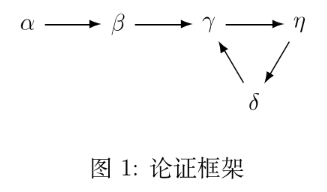

专业：人工智能
姓名：黄振华
学号：3240105155

### 1. 对于本讲内容，以下说法中错误的是（ ）。
A. 抽象论证理论是一种专门处理各种知识之间攻击关系的逻辑系统
B. 抽象论证框架可以被看作是有向图，其中论证是节点，攻击关系是有向边
C. 抽象论证理论刻画了论证的内部结构
D. 抽象论证理论没有表达攻击关系的来源

答案：C，因为抽象论证理论不刻画论证的内部结构，而是关注论证之间的攻击关系。

### 2.（多选）对于本讲内容，以下说法中正确的是（ ）。
A. 一个抽象论证框架的稳定外延都是该框架的半稳定外延
B. 如果 L 是抽象论证框架 AF 的一个基标记，那么 undec(L) = ∅
C. 一个包含 n 个论证的抽象论证框架有 2^n 个子框架
D. 给定一个抽象论证框架，如果其中某个论证是怀疑可辩护的，那么该论证也是轻信可辩护的

答案：A、C、D。

### 3. 设一个抽象论证框架有两个完全外延 E1 和 E2 。如果 E1 ⊂ E2 ，那么下列说法中一定正确的是（ ）。
A. E1 是基外延
B. E2 是稳定外延
C. E1 和 E2 都是优先外延
D. E1 不是优先外延

答案：D，因为 E1 不是极大的。

### 4. 给出图 1论证框架的优先语义、基语义和稳定语义。

**解答：**
- **论证集合**：$AR = \{\alpha, \beta, \gamma, \eta, \delta\}$
- **攻击关系**：$attacks = \{(\alpha, \beta), (\beta, \gamma), (\gamma, \eta), (\eta, \delta), (\delta, \gamma)\}$

分析如下：
1. $\alpha$ 没有受到任何攻击，一定在所有外延中（必须被接受）。
2. $\alpha$ 被接受，受到 $\alpha$ 攻击的 $\beta$ 一定被拒绝（out）。
3. 剩下的论证 $\{\gamma, \eta, \delta\}$ 构成了一个奇数长度的攻击循环：$\gamma \to \eta \to \delta \to \gamma$。

根据以上分析：
- **基语义**：基外延是最小的完全外延。因为奇循环中没有任何论证是无争议的，它们不能被防卫，所以基外延只包含这一个确定的起点。
  - **基外延**：$\{\alpha\}$
- **优先语义**：优先外延是极大的可容许集。若要接受循环中的 $\gamma$，需要防卫来自于 $\delta$ 的攻击，这就不得不接受 $\eta$，但 $\eta$ 又受到 $\gamma$ 的攻击，导致冲突。同理，其他节点也无法被加入，最大的可容许集无法扩展。
  - **优先外延**：$\{\{\alpha\}\}$
- **稳定语义**：稳定外延要求集合不仅无冲突，还要攻击所有不在该集合内的论证。候选的唯一外延 $\{\alpha\}$ 并没有攻击循环中的 $\gamma, \eta, \delta$，因此它不是稳定外延。因为包含独立的奇循环，不存在稳定外延。
  - **稳定外延**：$\emptyset$